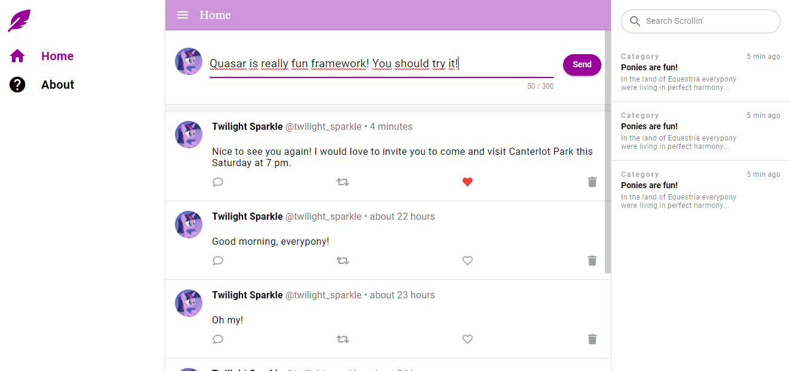
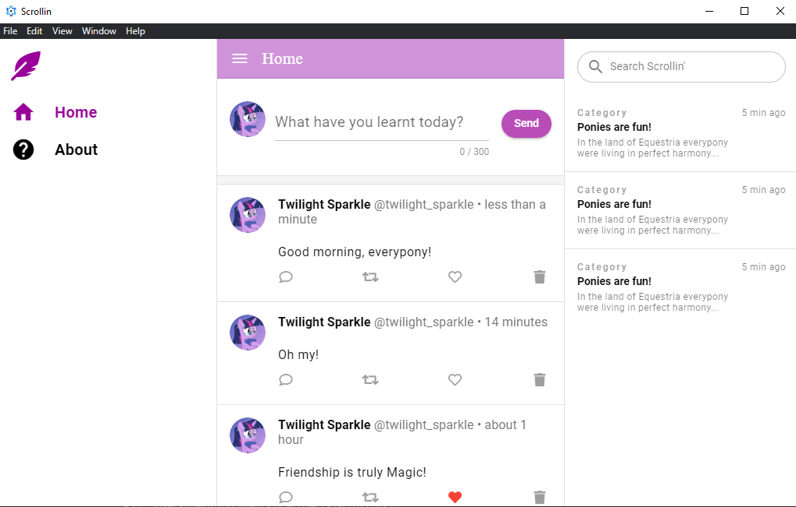
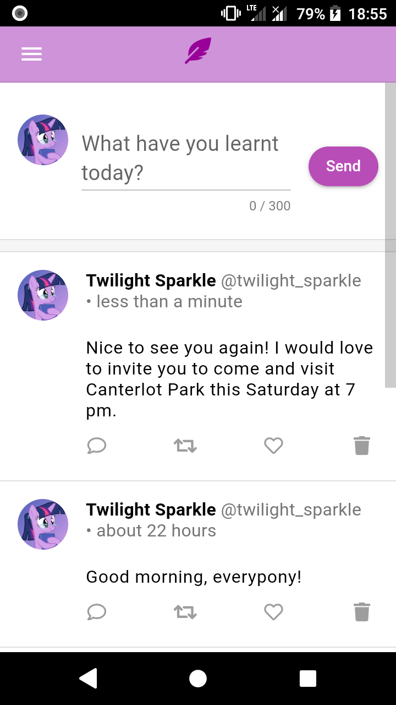

# Scrollin'

## What's new?

There is no new features.

## About project

Scrollin' is a multiplatform app made with Quasar framework based on this tutorial: https://www.youtube.com/watch?v=la-0ulfn0_M
This application allows you to post Twitter-like posts. You can also like your posts and delete. Every post is saved
in database using Firebase. This app can be running on several platforms:
- Web (in your web browser),
- Desktop (on Windows and Mac),
- Mobile (on Android and iOS).
Here is some screenshots for devices above.

Web

Desktop

Mobile

## Technologies used in the project

* Quasar Framework
* Vue.js

## Goals

Main goal is to learn new technology.

## License

My project is under BSD-2-Clause license. You can use some parts from my code but remember to credit me as an appreciation to my work! Thanks! Awoo!

© 2022 Paweł "Wilczeq/Vlk" Turoń
